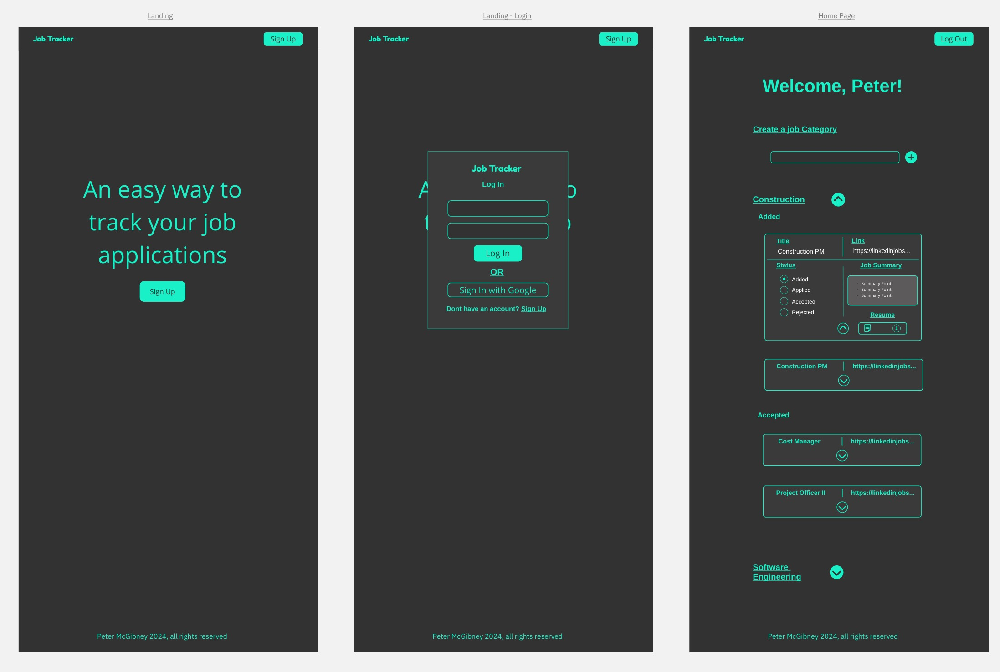
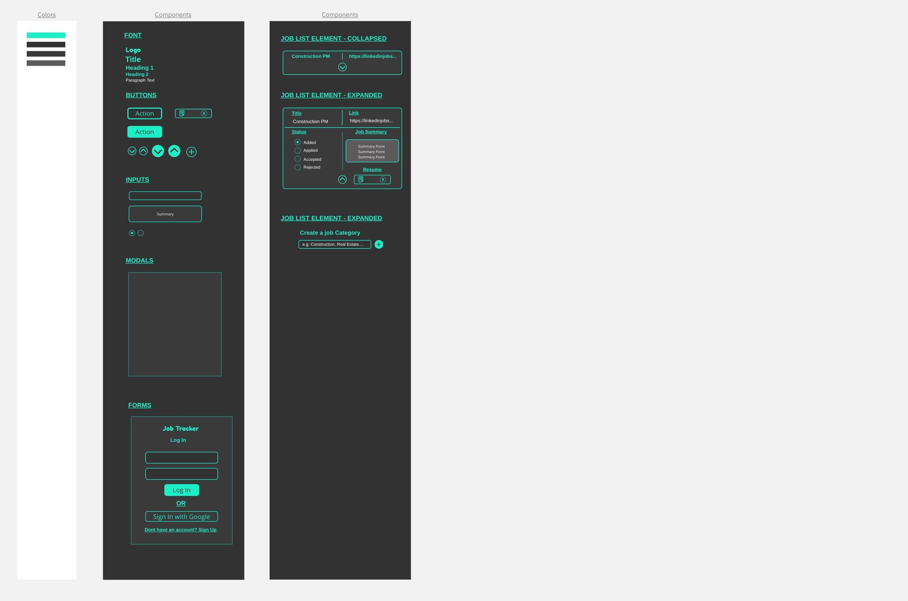

JobTrack

## Overview

 JobTrack is an app that helps you manage your job applications with ease. You can simply enter the basic details of each job you apply for, such as the company name, position, and deadline, and the app will automatically update the status of your application based on the feedback you receive. You can also link your job applications to the app, and it will generate a summary of the job description, requirements, and benefits for your reference. With JobTrack, you can keep track of your progress and stay organized in your job search.

## Planning
### Wireframing

<!-- 

 -->

## Getting Started

## Installation

